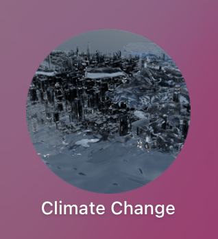
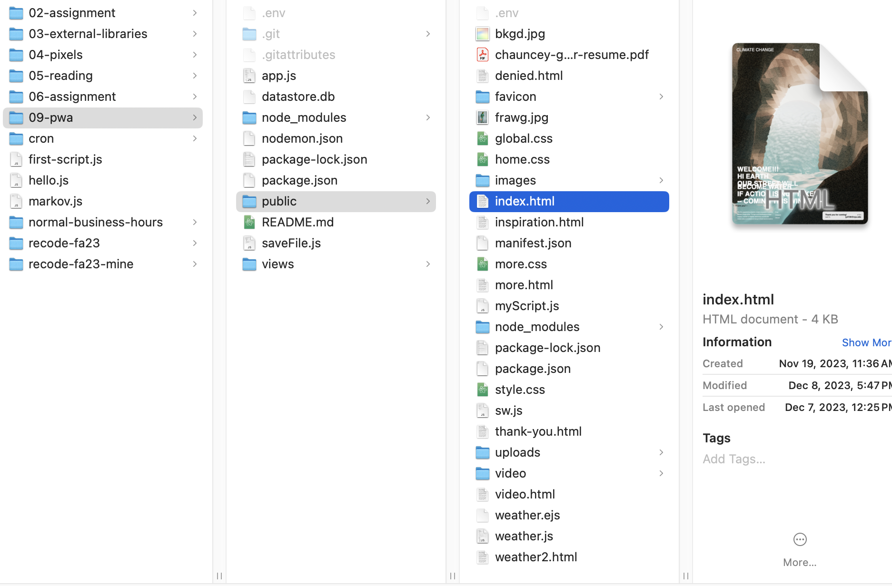
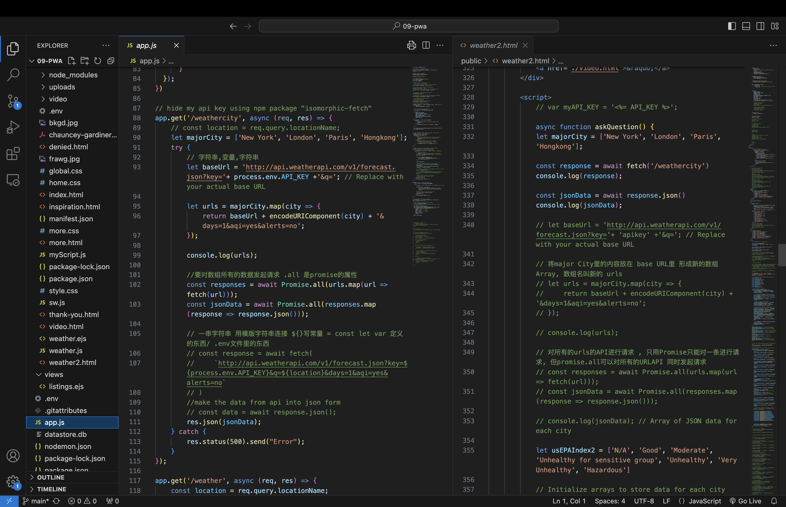

# 09 Progressive Web App
*The Final assignment for the ReCode class at NYU's IMA program, Fall 2023.*

## Project Description

Reserved IP address 206.189.254.67:3000

PC: You can check on my website by this URL and download it to your desktop.

Phone: You can also add to main page by this URL.

This progessive web app is inspired by the abrupt climate change. 

(Don't click on Inspiration and Post page, fix TBD)

**Set my aim:**

For this final project, I aim to challenge myself of the html, css, and javascript skills. 

**Hunt for references:**

I hunted lots of sample from Codepen such as Greensock animation, and interactive javascipt; also, W3C School is very helpful for css layout design for my webpage.

**Webpage Content:** 

The focus of the webpage is about the short film I made. 

This film presents the scientific model's forecasts of potential abstract climate shifts. Through vivid visualizations of their impacts, it strives to heighten awareness and educate viewers about immediate and abrupt climate transformations. The scenes delve into various states of water molecules, illustrating snow, ice, rain, rivers, and floods as examples. This film aims to emphasize that human actions are the primary drivers of climate change. It seeks to prompt audiences to recognize the imminent impact of our past choices on our lives, highlighting the urgency for change.

## Working Process:

For the home page, I used my previous main page style. Since the animation looks so smooth and I love to have it as the main page.

For the Weather page, I found out that the weather api also provides the air quality section; I think it will be fun to have this content on my webpage.

So I started to design what content I want the page to have and how I want the layout design for the page.

There are iterations for the webpage and I finally decided to use.

I was inspired by time zone wall clock, and I picked four major city to showcase how my page is going to be like.

  - New York (Eastern Time): Represents the Eastern Time Zone in the United States.

  - Chicago (Central Time): Represents the Central Time Zone in the United States.

  - Denver (Mountain Time): Represents the Mountain Time Zone in the United States.

  - Los Angeles (Pacific Time): Represents the Pacific Time Zone in the United States.

  - London (Greenwich Mean Time): Represents the GMT time zone.

  - Paris (Central European Time): Represents the Central European Time Zone.

  - Moscow (Moscow Standard Time): Represents Moscow Time (MSK).

  - Dubai (Gulf Standard Time): Represents Gulf Standard Time (GST).

  - Hong Kong: Represents Hong Kong Time (HKT) or China Standard Time (CST).

  - Tokyo: Represents Japan Standard Time (JST).

>These cities are often chosen because they represent key regions in different time zones across the world. By showing these cities' weathers helps people quickly glance at the current weather in those regions.

For the video page, I set the video to be the background and auto play as the page loads. I also add in a button so that the video can pause as the visitor wants. 

For the more page, I divided sections for my film project. I played with css to get the ideal box section for each slides, which I wish to make this page more interactive in the future by adding more javascript. 

### Coding Part:

  

  [All of my code are available on my github](https://github.com/Leahhha/09-pwa.git)

  
### Challenges:

  Parts of the most challenging code

  

  The most challenging part are:
  - Hiding the api key: I use another npm package, isomorphic-fetch (letting the server side code to do the same thing as user side code)
  - Getting the ideal CSS for Weather and Video page: I found out that even with the same css styling somehow the navigation looks different across pages. Noticing that H1,H2... tabs have built in style like padding, it is better giving it a div element and then set the height to adjust the height for navigation.

## Credit:

1. [Helpful CodePen example 1: animation navigation](https://codepen.io/Vishal4225/pen/JjmVZWK)

2. [Helpful CodePen example 2: animation of the main page and layout](https://codepen.io/nitin-sharma0001/pen/yLZXLXO)

3. [Helpful CodePen example 3: Text animation](https://codepen.io/StephenScaff/pen/oLBqmw) I tried to add this one in, but wasn't able to add in.

4. [Helpful w3schools example 4: Create pagination:](https://www.w3schools.com/howto/howto_css_pagination.asp)

5. [Helpful w3schools example 5: Image slide show](https://www.w3schools.com/howto/howto_js_slideshow.asp)

6. [Helpful w3schools example 6: Image text](https://www.w3schools.com/howto/howto_css_image_text.asp)

7. [Helpful w3schools example 7: Transparent image text](https://www.w3schools.com/howto/howto_css_image_transparent.asp)

8. [Helpful w3schools example 8: Fullscreen Video](https://www.w3schools.com/howto/howto_css_fullscreen_video.asp)
